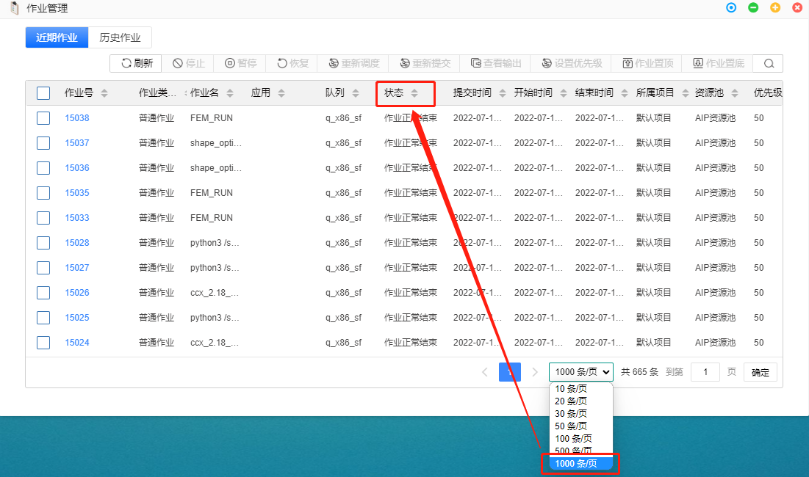
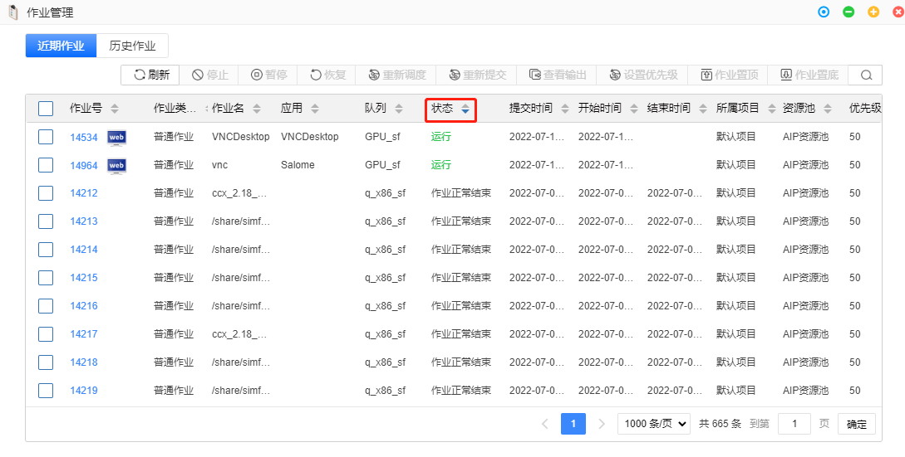

# 第6章 FAQ
## 图形相关

### VNC和VDI有什么区别？

- VDI：虚拟远程桌面接口

- VNC：虚拟网络控制台

|  图形界面   | 额外操作  | 是否额外付费 |  性能 |
|  :----:  | :----:  |  :----:  |  :----:  | 
| VDI  | 开通远程桌面|是 | 高 |
| VNC  | 无需额外步骤 | 否 | 一般 |

{ref}`仿真计算的GUI模式`和**图形应用**均可使用上述两种方式提交。
### VNC模式启动图形作业，软件窗口最小化后，或者存在多个窗口，如何切换选择？

鼠标中键，根据窗口名称单击选择，可切换出对应窗口

### VNC模式启动图形作业，VNC窗口关闭或30分钟重新进入平台，如何重新进入VNC窗口？

点击作业管理，找到对应的图形作业，单击作业号进入作业详情，在该作业的详情页面右上角单击**图形窗口**或通过作业管理作业号右边小图标即可重新进入。

### VDI模式启动图形作业，软件窗口最小化后，该如何恢复？

解锁底部dock栏，单击软件的窗口即可。
### 点击作业详情界面“图形窗口”，报错“无效链接”

只有以VNC模式启动的作业，点击图形窗口按钮可弹出软件界面，VDI模式启动的作业，直接单击dock栏远程桌面，进入远程桌面查软件界面

### 如何切换图形应用的运行模式？

已有实例，右击图标，选择默认实例，即可切换；若无对应实例，新建实例，设置图形应用以VNC或VDI模式启动。参考{ref}`配置实例`。

## 数据管理
### 文件、目录命名有什么要求？

文件、目录的命名不要带特殊字符（包括空格），可能会影响软件运行。建议使用A1_B2这样的命名方式。

### 如何在线编辑文件？

在线编辑文件有两种方式：一是通过数据管理，右击进行文本编辑；二是对于一些特殊后缀的文件，可开通VDI，通过shell 命令进行查看编辑。

### 上次文件速度慢？

由于浏览器策略，上传文件时，若切换标签页，可能导致上传减缓。因此，上次大文件时建议将浏览器页面停留在上传标签页。

## 作业管理

### 作业被系统强制终止

请确认作业提交时是否设置了运行时限。

### 重新进入门户后，运行的作业不在作业管理器首页？
点击作业管理，将显示条数增加以增加排序范围。

之后根据需要点击排序功能，如“状态”。

## 资源管理
### 队列的分类?

队列一般分为：
- CPU计算节点：如q_x86_sf
- GPU渲染节点：如GPU_sf

**警告** 请不要在使用**仿真计算**应用时提交至**GPU渲染队列**，作业将被管理员杀掉。

**警告** 请不要在使用**图形应用**时提交至**CPU计算队列**，作业将被管理员杀掉。

## 计费相关
### 信用额度和余额什么关系？ 
 信用额度是平台赠送金额，表示用户余额可透支额度。例如，信用额度为1000，则当账户余额小于-1000时，将无法提交作业直至您充值。

