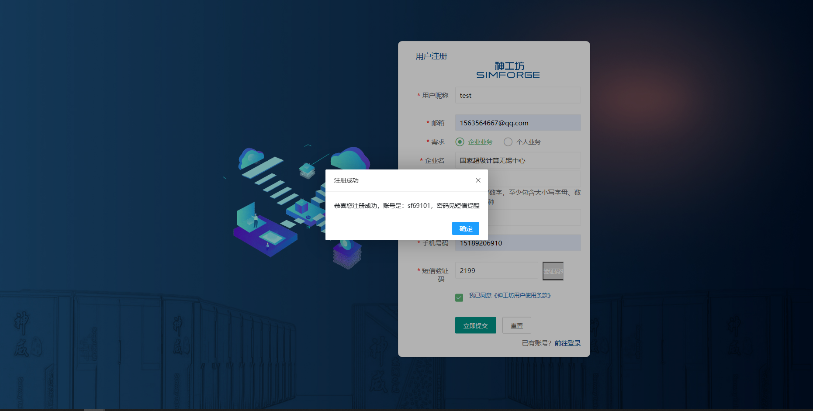
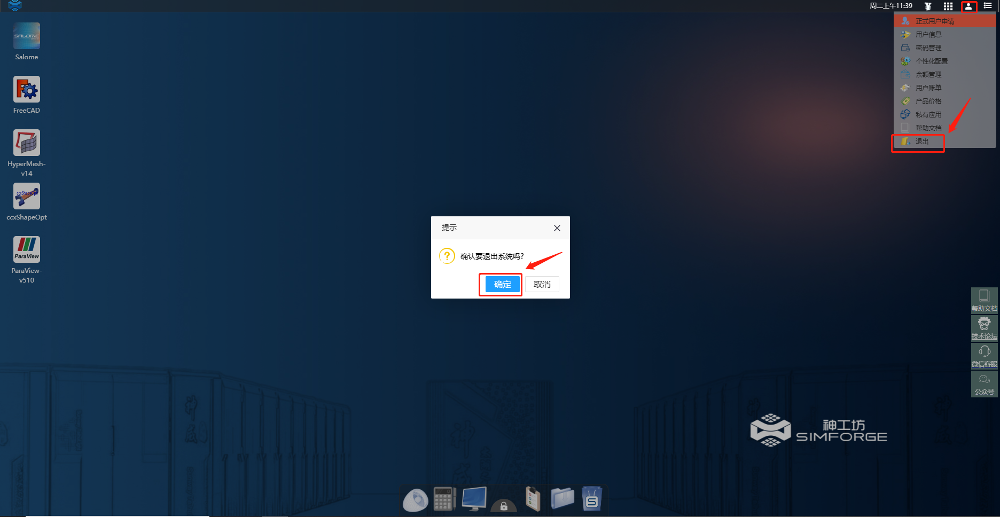
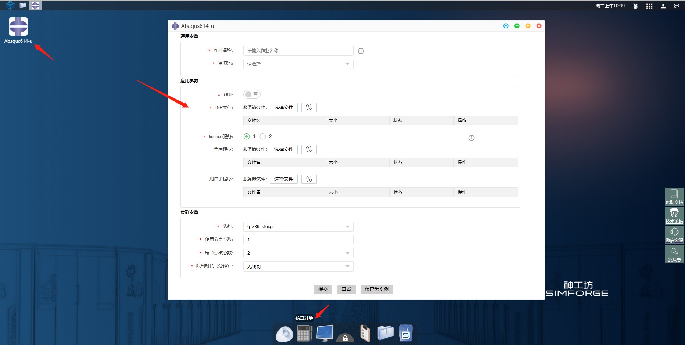
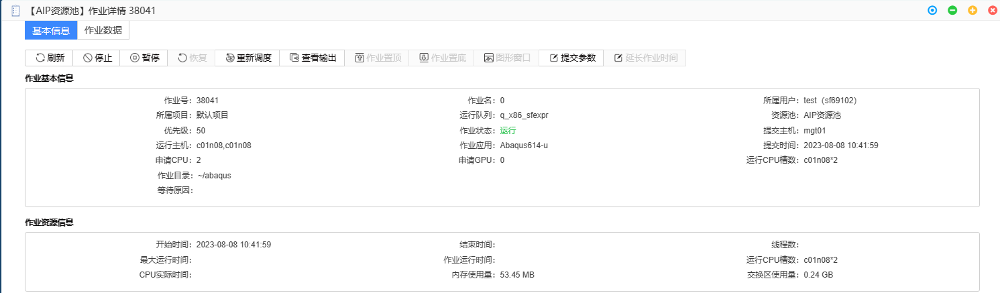
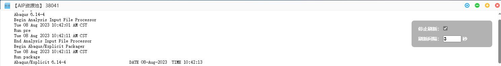
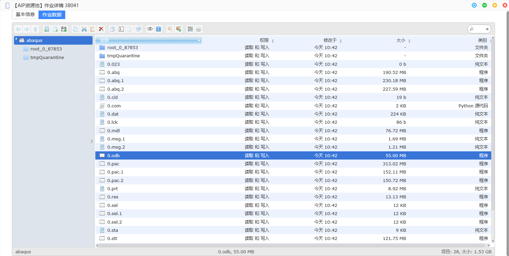
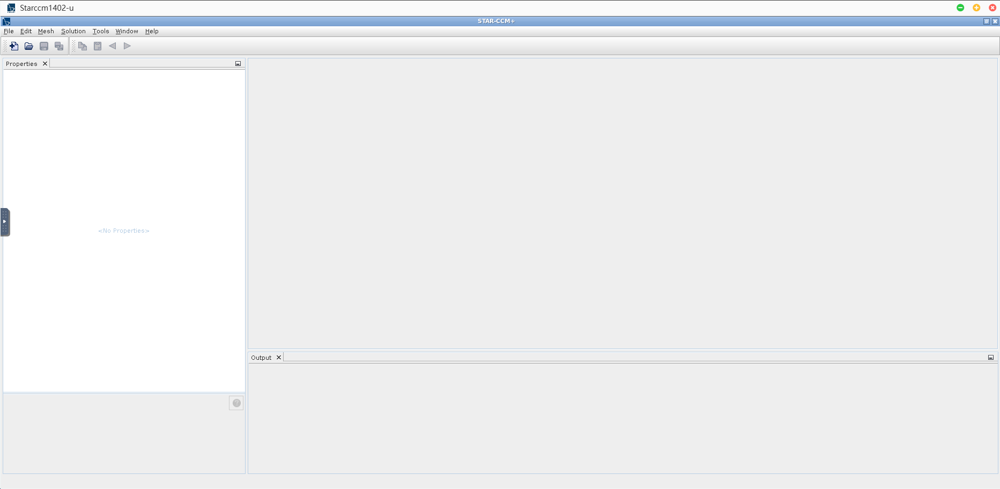
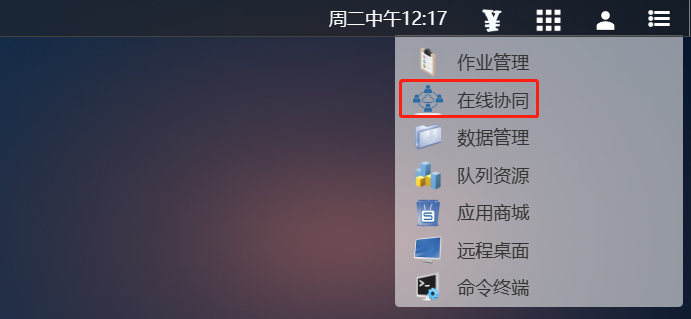
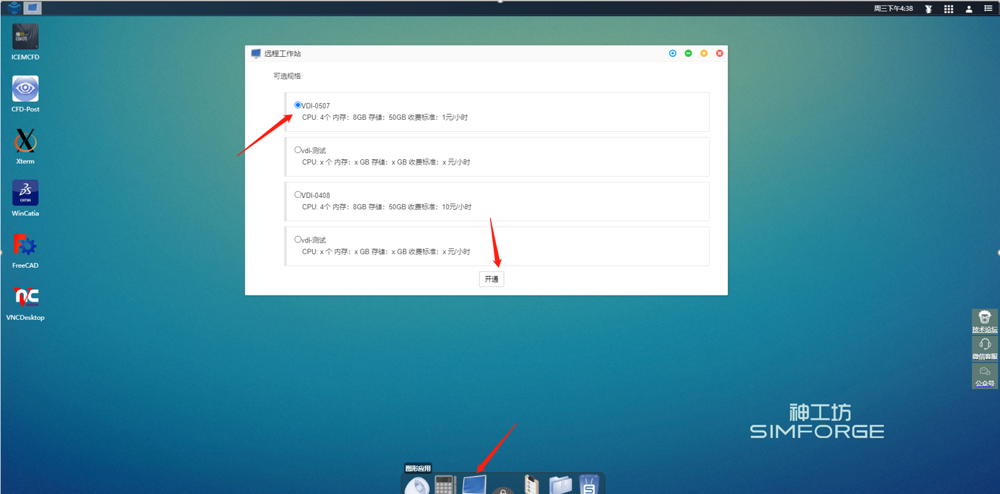
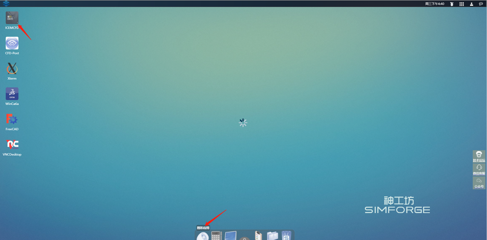

# 第2章 案例演示

##  访问用户门户

<!-- 

跳转到的地方 -->

您可以使用Web浏览器访问”神工坊“高性能仿真平台V2.0用户门户。

建议您使用Google Chrome或Microsoft Edge浏览器访问。

### 用户注册

a）打开浏览器，输入神工坊门户地址：[simforge.cn](http://simforge.cn/)

b）单击平台入口，进入平台注册登录页面:

b）点击 用户注册 进入注册界面，首先输入用户名：

c）点击继续，进入注册信息填写界面，填写注册信息，验证码会发送至注册邮箱:

d）点击注册，弹出注册成功提醒，等待管理员审核，审核通过后会发送账号及密码至注册邮箱：

### 用户登录

a）注册成功后，用户返回登录界面，或重新输入平台门户，点击平台登录，进入登录页面：

b）点击登录，即可进入用户门户

<!--  -->

### 用户退出

a）单击topbar 右上角 用户管理 按钮，下拉框选择 退出，弹窗 单击 确定按钮，完成用户的退出

## 仿真计算

### 案例一：Abaqus 仿真计算应用

**案例说明** 

本案例展示了最基础的提交仿真计算作业的方式。

**操作演示**

**a）工程文件上传：** 登录平台后，**单击**底部dock栏 **数据管理**图标，打开数据管理窗口，单击**上传文件**按钮，上传工程文件：

**b）上传：** 点选或者拖放上传工程文件至平台：

**c）启动应用：** 登录平台后，**单击**底部dock栏**仿真计算**图标，进入仿真计算应用桌面，**双击**桌面**Abaqus614**软件图标，弹出作业提交界面：

**d）作业参数设置：** 输入作业相关参数，单击**选择文件**，选中上传的工程文件，双击完成选择：

**e）作业提交：** 单击提交，完成作业的提交，进入作业详情界面：

**f) 查看输出：** 单击查看输出，进入作业输出界面：

**g) 计算完成，查看结果：** 单击**作业数据**，进入个人文件目录，即可查看输出结果文件。如需关闭后再次查看，请点击下方dock栏作业管理，点击作业号进入。

### 案例二：StarCCM+ 仿真计算应用

**案例说明** 

本案例展示了基于“神工坊”V2.0 进行StarCCM+仿真作业及在线协同的基本操作，演示算例是一个千万网格的搅拌器模型。

**操作演示**

**a）启动应用：** 登录平台后，**单击**底部dock栏**仿真计算**图标，进入仿真计算应用桌面，**双击**桌面StarCCM+软件图标，弹出作业提交界面：

**b）作业参数设置：** 输入作业相关参数，单击提交，提交计算：

**资源池：** 选择AIP资源池

**GUI：** 图形显示方式，选择VNC

**队列：** 作业提交的队列，仿真计算应用 选择q_x86_sf

**CPU核数：** 拟并行的进程数

**每节点使用的核心数：** CPU核数/每节点使用的核心数=占用的节点数，q_x86_sf队列，每节点使用的核心数不能超过128核

**c）作业详情：** 提交后进入作业详情界面，显示作业一些详细信息。单击 图形窗口 按钮，进入软件原生界面：

**d）软件并行设置：** 软件操作同本地一致，其中并行模式选择 parallel on Local Host，并行核数同 b) 步骤中一致

**e）在线协同：** 对于企业用户，在平台有多个用户，可以在线共享图形界面（仅支持VNC模式），单击顶栏功能管理下拉框，选择在线协同：

**f）共享作业：** 弹出的在线协同窗口中选择作业连接页面，选择要共享的作业，单击操作列里的分享按钮：

**g）共享成员选择：** 弹窗中选择共享模式，选择需要共享给的成员，点击提交：

**观察：** 被共享者只可观看图形界面
**互动：** 被共享者可操作图形界面

**h）共享成功：** 共享成功后，作业 操作列 按钮增加断开分享按钮，点击可以端口分共享：

**i）协同作业：** 被共享者，登录桌面后，在 在线协同 界面，协同连接 子页面可以查看被共享的作业，点击连接进入共享界面:

## 图形应用

### 案例三：ICEMCFD 图形应用案例

**案例说明** 

本案例演示了通过远程桌面（VDI）模式使用ICEMCFD，VDI模式具有更高的流畅度和清晰度，为复杂模型的前后处理工作提供了较好的用户体验。

**操作演示**

**a）远程桌面开通：** 点击桌面底部dock栏**远程桌面**图标，弹出远程桌面开通界面：

**b）进入远程桌面：** 单击开通后，弹出远程桌面进入界面，单击图标，进入远程桌面

**c）远程桌面窗口：** 远程桌面窗口如下所示：

**e）软件启动：** 单击底部dock栏**图形应用**，双击桌面ICEMCFD图标，软件启动：

**f）软件启动成功：** 软件启动成功后，会自动切换至VDI桌面窗口，软件已启动，软件的操作同用户本地使用一样，具体使用参考ICEMCFD帮助文档

**g）隐藏dock栏：** dock栏会遮挡VDI桌面，影响底部区域的鼠标操作，因此需要隐藏。单击dock中间锁按钮，将其解锁。

解锁状态，鼠标移开dock区域，或者单击桌面其他区，dock栏会自动隐藏至桌面底部，鼠标向下划过桌面边界，dock栏再次浮现：

### 案例四：CFD-Post图形应用案例

**案例说明** 
本案例演示了通过VNC模式使用CFD-Post图形应用，VNC模式支持图形窗口的在线共享。

**操作演示**

**a）实例创建：** 图形应用默认采用VDI模式启动，因此首先需要修改启动模式为VNC。右击CFD-Post桌面图标，选择编辑实例：

**b）新增实例：** 弹窗弹出实例创建界面，单击右上角新增实例，填写实例参数：

**c）设置默认实例：** 单击保存后新增实例成功，勾选新增实例，单击右上角 设置为默认实例 按钮，弹窗点击 确定，设置CFD-Post图形应用默认启动方式为VNC：

**d）启动软件：** 双击桌面图标，此时CFD-Post将以VNC模式启动

