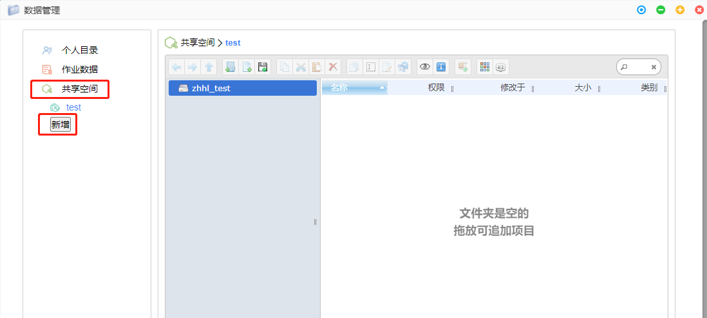
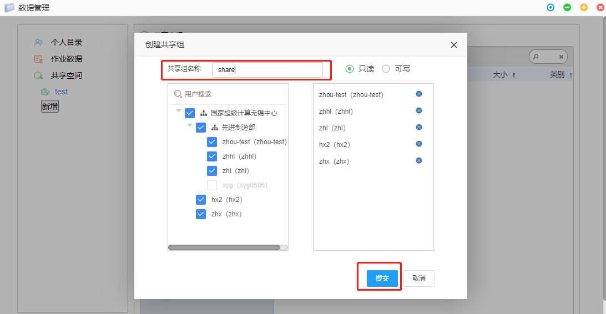
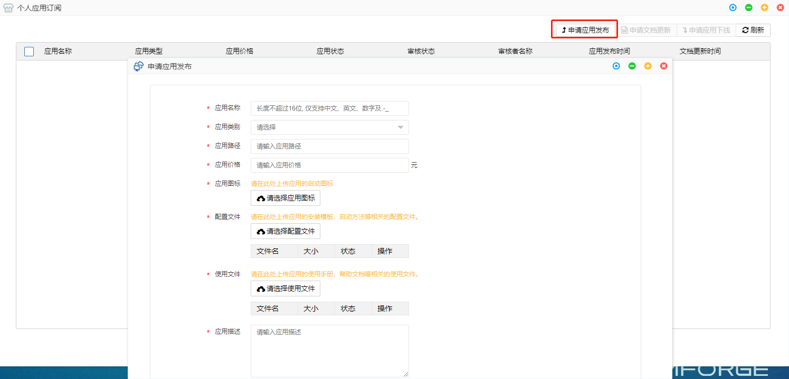

# 第4章 特色功能

## 远程桌面

远程桌面功能使得熟悉命令行的用户能够使用Linux虚拟机。目的是提供**更方便、更灵活、更高效**的集群使用方式：

1. 高性能图形应用
2. 自行编写脚本（批量作业、前后处理）
3. 自行编写、编译程序，提交集群计算

## 共享空间

对于企业用户，同一组织的成员能够创建共享空间分享文件给其他人。文件的权限可以灵活设置。

1. 在数据管理窗口中点击共享空间 > 新增
2. 在共享设置窗口中设置：共享组名称、组织用户、用户权限
3. 点击提交

## 在线协同

对于企业用户，在平台有多个用户，可以在线共享图形界面（仅支持VNC模式）

参考案例演示：{ref}`案例二：StarCCM+ 仿真计算应用`
## 命令终端

熟悉命令行的用户，可以使用命令终端功能来操作文件、提交作业等。

## 私有应用

用户可以发布自己的应用。可供本人、组织成员甚至其他人使用应用。

