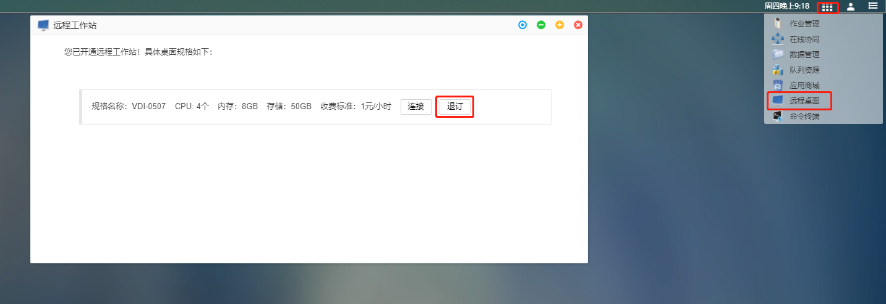
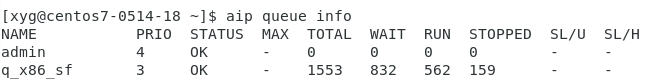
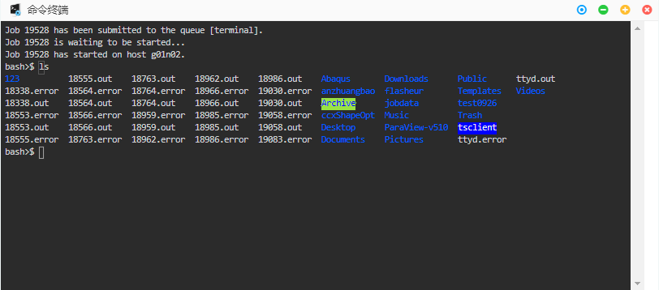

# 第4章 特色功能

## 远程桌面

 

<!-- 远程桌面提供给用户一个具备图形界面的**Linux虚拟机**。目的是提供**更方便、更灵活、更高效**的集群使用方式： -->

远程桌面提供给用户一个具备图形界面的**Linux虚拟机**，图形应用通过GPU渲染后会显示在远程桌面中。用户还可以在远程桌面中通过命令行执行相关命令，如程序编译、运行、脚本执行等，目的是提供**更方便、更灵活、更高效**的集群使用方式。远程桌面挂载了用户的存储空间，可直接通过命令行访问存储目录。

远程桌面适用于以下场景

1. 大规模仿真前后处理，需要流畅、清晰图形显示和操作
2. 需要自行编写脚本实现作业批量提交运行
3. 自研程序需要在线编译，并运行在神工坊集群上


### 远程桌面开通

点击dock栏进入远程桌面开通界面，选择规格，点击**开通**。


### 远程桌面退订
点击topbar**功能管理***按钮，下拉框选择**远程桌面**， 弹窗中显示已开通的远程桌面规格



**连接：** 进入远程桌面

**退订：** 退订远程桌面

**注意**：退订后远程桌面内运行的作业，进程将全部结束，请谨慎操作！

### 远程桌面使用

#### 基本使用
**进入远程桌面：**

**方法一：** 单击dock栏**远程桌面**图标，进入已开通的远程桌面

**方法二：** 单击topbar**功能管理**图标，下拉框选择**远程桌面**， 弹窗中选择**连接**按钮，进入已开通远程桌面


远程桌面是一个带有图形界面的Linux虚拟机，基本使用同linux发行版 Centos或者Ubuntu一致，详细请参考相关使用教程。
#### 递交作业

##### 查看队列资源
```bash
aip queue info
```


##### csub任务提交命令
###### 通用作业提交，调度器自动分配节点

```bash
csub -I -q q_x86_sf -n 8 -o %J.out -e %J.error <command> # 交互提交
csub -q q_x86_sf -n 8 -o %J.out -e %J.error <command> # 后台提交
```
- -I：程序输出会打印到终端，终端关闭则程序终止运行。
- -q：后接队列名，如q_x86_sf
- -n：后接程序运行使用核心数
- -o：后接文件名，将输出打印至该文件中。%J.out代表以作业号命名的文件，调度器自动生成
- -e：后接文件名，将错误信息打印至该文件中。%J.error代表以作业号命名的文件，调度器自动生成
- command：Linux系统运行程序的命令

###### 跨节点作业提交，指定每节点核数
```bash
csub -I -q q_x86_sf -n 64 -R span[ptile=32] -o %J.out -e %J.error <command>
```
- -R span[ptile=32] 每节点核数为32

更多命令参数请查看csub文档：
```bash
man csub
```

#### 递交MPI作业
- 基于MPICH的MPI实现
包括Intel MPI、MPICH、MVAPICH
```bash
spack load mpich@3.4.2%gcc@4.8.5 # 加载mpich-3.4.2
module load Intel/parallel_studio_xe_2018/2018 # 加载Intel2018程序包
csub -n 64 -q q_x86_sf mpirun ./myprogram
```

- 基于OpenMPI的MPI实现 
包括OpenMPI、Platform/HP/IBM MPI
```bash
spack load openmpi@4.1.2%gcc@4.8.5 # 加载openmpi-4.1.2
csub -n 64 -q q_x86_sf ompi-mpirun ./myprogram
```

#### 客户端模式使用远程桌面
远程桌面可以通过客户端模式访问，基于客户端，能够给用户提供更加流畅、清晰的图形操作体验。

客户端连接前，请先在平台开通远程桌面

**客户端下载**

用户可以通过以下网站，选择相应版本，下载客户端：

[https://customerconnect.vmware.com/en/downloads/info/slug/desktop_end_user_computing/vmware_horizon_clients/horizon_8](https://customerconnect.vmware.com/en/downloads/info/slug/desktop_end_user_computing/vmware_horizon_clients/horizon_8)


下载后进行安装

**客户端设置**
用户启动客户端后，首先进行客户端的设置，点击右上角下拉框，选择**配置SSL**，弹窗中选择**不验证服务器身份证书**，确定


**VDI连接**
单击新建服务器，弹窗里输入VDI服务器地址：studio.hpc.simforge.cn


单击连接,随后弹窗中输入平台账号密码:


登录后即可看到在平台开通的VDI，点击进入远程桌面

#### 编译程序

##### 加载相关库
- 查看已安装的包
```bash
spack find # 查看已安装的包

==> 74 installed packages
-- linux-centos7-cascadelake / gcc@10.2.0 -----------------------
autoconf@2.69                libbsd@0.11.3    perl@5.34.0
autoconf-archive@2019.01.06  libffi@3.3       pkgconf@1.8.0
automake@1.16.3              libiconv@1.16    python@3.9.9
berkeley-db@18.1.40          libmd@1.0.3      readline@8.1
bzip2@1.0.8                  libsigsegv@2.13  sqlite@3.36.0
cmake@3.22.1                 libtool@2.4.6    tar@1.34
diffutils@3.8                libxml2@2.9.12   texinfo@6.5
expat@2.4.1                  m4@1.4.19        util-linux-uuid@2.36.2
gcc@10.2.0                   mpc@1.1.0        xz@5.2.5
gdbm@1.19                    mpfr@4.1.0       zlib@1.2.11
gettext@0.21                 ncurses@6.2      zstd@1.5.0
gmp@6.2.1                    openssl@1.1.1l

-- linux-centos7-haswell / gcc@4.8.5 ----------------------------
autoconf@2.69         libevent@2.1.12    openmpi@4.1.2
automake@1.16.3       libfabric@1.14.0   openssh@8.7p1
berkeley-db@18.1.40   libffi@3.3         openssl@1.1.1l
bzip2@1.0.8           libiconv@1.16      perl@5.34.0
cmake@3.22.1          libmd@1.0.3        pkgconf@1.8.0
diffutils@3.8         libpciaccess@0.16  python@3.9.9
expat@2.4.1           libsigsegv@2.13    readline@8.1
findutils@4.8.0       libtool@2.4.6      sqlite@3.36.0
gdbm@1.19             libxml2@2.9.12     tar@1.34
gettext@0.21          m4@1.4.19          util-linux-uuid@2.36.2
hwloc@2.6.0           mpich@3.4.2        util-macros@1.19.3
libbsd@0.11.3         ncurses@6.2        xz@5.2.5
libedit@3.1-20210216  numactl@2.0.14     zlib@1.2.11
```
- 加载编译器
```bash
spack load gcc@10.2.0 # 加载10.2.0版本gcc编译器
```
- 多个版本库的加载
```bash
spack load cmake # 加载cmake提示有多个版本的包

==> Error: cmake matches multiple packages.
  Matching packages:
    qapiaa2 cmake@3.22.1%gcc@4.8.5 arch=linux-centos7-haswell
    7latf3f cmake@3.22.1%gcc@10.2.0 arch=linux-centos7-cascadelake
  Use a more specific spec.

spack load cmake@3.22.1%gcc@10.2.0 # 加载gcc-10.2.0编译的版本
```

## 共享空间

对于企业用户，同一组织的成员能够创建共享空间分享文件给其他人。文件的权限可以灵活设置。
### 共享空间创建
1. 在数据管理窗口中点击 **共享空间**，展开的树形结构中单击 **新增** 
2. 弹出共享空间设置窗口，填写相关参数

**共享组名称：** 只支持字母、数字和下划线

**组织成员：** 弹窗左侧树形结构显示组织成员，勾选确定共享组成员

**共享组权限：** 弹窗右侧上部，设置共享组权限，**只读** 表示被共享成员只能查看下载共享数据；**可写**，表示被共享成员可以上传数据至共享空间。

**共享组成员：** 弹窗右侧线框内显示勾选的共享组成员

3. **提交**按钮，创建共享组；取消按钮，取消本次创建


### 共享空间删除

**右击** 已创建的共享空间，单击删除共享空间，弹窗选择 **确定**


 **注意：** 只有共享组创建者才可以删除共享组，被共享成员无法删除共享组。如上图，上面两个橙色共享组（test、aaa）是该用户创建，下面两个绿色共享组（1、test0520）是其他成员创建。

## 在线协同
在线协同主要用于组织内部成员之间进行图形界面的共享，实现在线协同仿真工作，启动方式如下：

单击topbar **功能管理**按钮，下拉框单击**在线协同**按钮，进入在线协同设置页面

### 界面导航

在线协同页面有三个子页面，分别为作业管理，应用管理和协同管理

**作业连接**子页面显示的是以VNC方式运行仿真计算应用作业

**应用连接**子页面显示的是以VNC方式启动的图形应用作业

**协同管理**子页面显示的是被分享的图形界面作业


在作业连接、应用连接页面，显示相关作业列表，每个作业会有作业号、作业名称、所属项目、应用名称、开始时间、分享状态、分享目标、操作属性栏

**分享状态：** 显示作业是否被分享

**分享目标：** 显示作业分享的账号

**操作：** 操作栏显示分享相关的操作


### 界面共享


作业未被共享时，操作栏有两个按钮**连接**和**分享** 

 **连接：** 点击进入作业图形界面

 **分享：** 点击弹出图形界面分享设置界面，界面如下所示：


**权限：** 勾选被共享者之前可以设置共享权限，**观察**表示被共享者只能浏览被共享页面，**互动**表示被共享者可以操作被共享的页面


左侧设置框内 勾选想要分享的组织成员，勾选后在右侧显示被分享者及分享权限

共享成功后，作业状态变为**分享中**，操作栏新增按钮**断开** ，单击断开按钮，弹窗选择确定后可以结束共享


### 协同管理

协同管理页面显示的是被共享的作业列表，每个作业具有协同作业号、协同作业名称、分享者、所属项目、应用名称、开始时间、分享时间、操作属性栏

被分享作业，操作栏会有**连接**按钮，单击可进入被共享的界面


## 命令终端

命令终端是一个命令行程序，使用linux命令进行操作，可以看做是个网页版的远程终端。熟悉命令行的用户，可以使用命令终端功能来操作文件、提交作业等。

### 基本操作

在功能管理中选择命令终端，点击后打开命令终端界面。


打开后可进行命令行操作。如输入ls，可以查看用户文件夹中包含的文件。



用户完成命令行操作后，点击命令终端窗口右上角即可退出命令终端。


### 加载编译器和库

#### spack 方式

- 查看已安装的包

```bash
spack find # 查看已安装的包

==> 74 installed packages
-- linux-centos7-cascadelake / gcc@10.2.0 -----------------------
autoconf@2.69                libbsd@0.11.3    perl@5.34.0
autoconf-archive@2019.01.06  libffi@3.3       pkgconf@1.8.0
automake@1.16.3              libiconv@1.16    python@3.9.9
berkeley-db@18.1.40          libmd@1.0.3      readline@8.1
bzip2@1.0.8                  libsigsegv@2.13  sqlite@3.36.0
cmake@3.22.1                 libtool@2.4.6    tar@1.34
diffutils@3.8                libxml2@2.9.12   texinfo@6.5
expat@2.4.1                  m4@1.4.19        util-linux-uuid@2.36.2
gcc@10.2.0                   mpc@1.1.0        xz@5.2.5
gdbm@1.19                    mpfr@4.1.0       zlib@1.2.11
gettext@0.21                 ncurses@6.2      zstd@1.5.0
gmp@6.2.1                    openssl@1.1.1l

-- linux-centos7-haswell / gcc@4.8.5 ----------------------------
autoconf@2.69         libevent@2.1.12    openmpi@4.1.2
automake@1.16.3       libfabric@1.14.0   openssh@8.7p1
berkeley-db@18.1.40   libffi@3.3         openssl@1.1.1l
bzip2@1.0.8           libiconv@1.16      perl@5.34.0
cmake@3.22.1          libmd@1.0.3        pkgconf@1.8.0
diffutils@3.8         libpciaccess@0.16  python@3.9.9
expat@2.4.1           libsigsegv@2.13    readline@8.1
findutils@4.8.0       libtool@2.4.6      sqlite@3.36.0
gdbm@1.19             libxml2@2.9.12     tar@1.34
gettext@0.21          m4@1.4.19          util-linux-uuid@2.36.2
hwloc@2.6.0           mpich@3.4.2        util-macros@1.19.3
libbsd@0.11.3         ncurses@6.2        xz@5.2.5
libedit@3.1-20210216  numactl@2.0.14     zlib@1.2.11
```
- 加载编译器
```bash
spack load gcc@10.2.0 # 加载10.2.0版本gcc编译器
```
- 多个版本库的选择
```bash
spack load cmake # 加载cmake提示有多个版本的包

==> Error: cmake matches multiple packages.
  Matching packages:
    qapiaa2 cmake@3.22.1%gcc@4.8.5 arch=linux-centos7-haswell
    7latf3f cmake@3.22.1%gcc@10.2.0 arch=linux-centos7-cascadelake
  Use a more specific spec.

spack load cmake@3.22.1%gcc@10.2.0 # 加载gcc-10.2.0编译的版本
spack load /qapiaa2 # 根据唯一识别码加载编译器qapiaa2 cmake@3.22.1%gcc@4.8.5 arch=linux-centos7-haswell
```
#### module方式
- 查看已安装的库
```bash
module avail
```


- 加载程序包

```bash
module load Intel/parallel_studio_xe_2018/2018 # 加载Intel2018程序包
```

### 递交作业

#### 查看队列资源
```bash
aip queue info
```


#### csub任务提交命令
###### 通用作业提交，调度器自动分配节点
```bash
csub -I -q q_x86_sf -n 8 -o %J.out -e %J.error <command> # 交互提交
csub -q q_x86_sf -n 8 -o %J.out -e %J.error <command> # 后台提交
```
- -I：交互式。程序输出会打印到终端，终端关闭则程序终止运行。
- -q：后接队列名，如q_x86_sf
- -n：后接程序运行使用核心数
- -o：后接文件名，将输出打印至该文件中。%J.out代表以作业号命名的文件，调度器自动生成
- -e：后接文件名，将错误信息打印至该文件中。%J.error代表以作业号命名的文件，调度器自动生成
- command：Linux系统运行程序的命令

###### 跨节点作业提交，指定每节点核数
```bash
csub -I -q q_x86_sf -n 64 -R span[ptile=32] -o %J.out -e %J.error <command>
```
- -R span[ptile=32] 每节点核数为32

更多命令参数请查看csub文档：
```bash
man csub
```
#### 递交MPI作业
- 基于MPICH的MPI实现
包括Intel MPI、MPICH、MVAPICH
```bash
spack load mpich@3.4.2%gcc@4.8.5 # 加载mpich-3.4.2
module load Intel/parallel_studio_xe_2018/2018 # 加载Intel2018程序包
csub -n 64 -q q_x86_sf mpirun ./myprogram
```

- 基于OpenMPI的MPI实现 
包括OpenMPI、Platform/HP/IBM MPI
```bash
spack load openmpi@4.1.2%gcc@4.8.5 # 加载openmpi-4.1.2
csub -n 64 -q q_x86_sf ompi-mpirun ./myprogram
```
## 私有应用

神工坊应用商城可以支持用户自研应用的入驻，通过平台私有应用发布功能进行个人应用的在线发布。

平台目前私有应用发布流程为：用户通过远程桌面虚拟机完成软件在线编译部署->在线提交发布申请->管理员审核->应用上线。

### 界面导航
单击topbar，个人信息按钮，下拉框选择私有应用，进入私有应用界面


私用应用界面顶栏有三个按钮，分别为：

{ref}`申请应用发布`： 提交应用发布申请

{ref}`申请文档更新`：对已发布的应用进行用户帮助文档的更新

{ref}`申请应用下线`：下线已发布的应用

顶栏下方显示了用户私有应用列表，列表有**应用名称、应用类型、应用价格、应用状态、审核状态、审核者名称、应用发布时间、文档更新时间**属性

### 申请应用发布
单击按钮，进入应用发布申请界面，填写相关参数后，点击**提交**完成发布申请：


发布申请参数说明：

**应用名称：** 发布应用的名称，长度不超过16位，仅支持中文、英文、数字和-符合；

**应用类别：** 可选择图形应用，或者仿真计算；

**应用路径：** 应用在平台的安装路径；

**应用价格：** 应用标准定价，单位为 元/核小时；

**应用图标:** 应用图标，白底为背景，建议图片长宽一致，否则会有变形情况

**配置文件：** 上传应用安装部署、启动等相关配置说明文件，供管理员进行应用集成

**使用文件：** 上传应用的用户手册、演示案例等用户帮助文档，方便其他用户快速上手使用

**应用描述：** 对应用的功能进行简述，方便其他用户快速了解选择

### 申请文档更新

单击按钮，进入文档更新申请页面，重新上传文档，单击**更新**按钮，申请提交:


## 组织管理

对于企业用户，在平台有多个用户，企业**组织管理员**可以对组织用户进行管理、查看组织总体账单等。

### 用户管理


#### 创建用户
- 登录账号：登录平台的账号
- 用户昵称：可设置为姓名全拼
- 组织：当前组织
- 部门：选择所属部门


#### 修改用户
除登录账户外一般均可修改
#### 删除用户

**警告** 删除用户会将用户的所有关联信息及个人目录都删除,请谨慎操作！

#### 激活并设置角色

创建完成后的账号需激活并设置角色后才能正常使用。

角色分为：
- 普通用户
- 组织管理员

#### 禁用

禁止一个或多个账户的使用

#### 设置应用

配置用户可以使用的应用，默认为空。


### 用户组管理


#### 创建用户组
创建用户组使得组织管理员能够自由组合组织成员，实现多级管理。


#### 修改用户组
修改已经创建的用户组，但只能修改组织名。
#### 删除用户组
删除已经创建的用户组。

#### 组员管理

给用户组配置组员


### 组织账单


- 重置：重置月份区间
- 导出：下载账单至本地，格式为*.xlsx

#### 月份区间
选择列表显示的区间


#### 月账单查看

点击左侧月份进入月账单查看。
- 所属用户：可根据用户筛选显示


