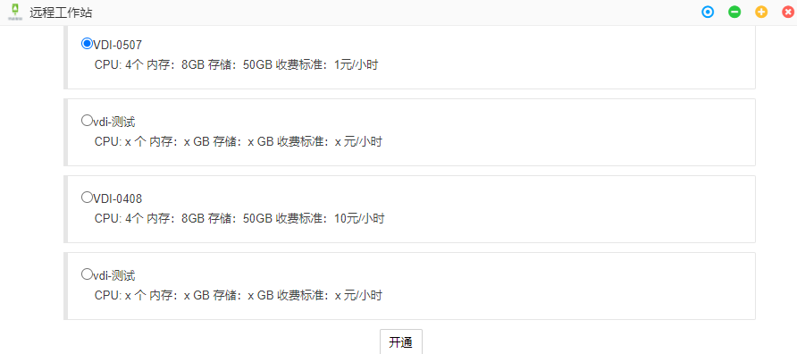

# 第4章 特色功能

## 远程桌面

 

<!-- 远程桌面提供给用户一个具备图形界面的**Linux虚拟机**。目的是提供**更方便、更灵活、更高效**的集群使用方式： -->

远程桌面提供给用户一个具备图形界面的**Linux虚拟机**，图形应用通过GPU渲染后会显示在远程桌面中。用户还可以在远程桌面中通过命令行执行相关命令，如程序编译、运行、脚本执行等，目的是提供**更方便、更灵活、更高效**的集群使用方式。远程桌面挂载了用户的存储空间，可直接通过命令行访问存储目录。

1. 高性能图形应用
2. 自行编写脚本（批量作业、前后处理）
3. 自行编写、编译程序，提交集群计算


### 远程桌面开通

点击进入远程桌面，选择规格，点击开通。


### 远程桌面退订
点击其他功能按钮 > 远程桌面 > 退订


### 远程桌面使用

#### 基本使用
远程桌面为Linux虚拟机，使用方式与一般Linux桌面相同相同。
#### 递交作业

##### 查看队列资源
```bash
aip queue info
```
##### csub任务提交命令
```bash
csub -I -q q_x86_sf -n 8 -o %J.out -e %J.error <command>
```
- -I：程序输出会打印到终端，终端关闭则程序终止运行。
- -q：后接队列名，如q_x86_sf
- -n：后接程序运行使用核心数
- -o：后接文件名，将输出打印至该文件中
- -e：后接文件名，将错误信息打印至该文件中
- command：Linux系统运行程序的命令

更多命令参数请查看csub文档：
```bash
man csub
```
#### 编译程序
## 共享空间

对于企业用户，同一组织的成员能够创建共享空间分享文件给其他人。文件的权限可以灵活设置。

1. 在数据管理窗口中点击共享空间 > 新增
2. 在共享设置窗口中设置：共享组名称、组织用户、用户权限
3. 点击提交


## 在线协同

对于企业用户，在平台有多个用户，可以在线共享图形界面（仅支持VNC模式）

参考案例演示：{ref}`案例二：StarCCM+ 仿真计算应用`
## 命令终端

熟悉命令行的用户，可以使用命令终端功能来操作文件、提交作业等。

## 私有应用

用户可以发布自己的应用。可供本人、组织成员甚至其他人使用应用。


## 组织管理

对于企业用户，在平台有多个用户，企业**组织管理员**可以对组织用户进行管理、查看组织总体账单等。

### 用户管理


#### 创建用户
- 登录账号：登录平台的账号
- 用户昵称：可设置为姓名全拼
- 组织：当前组织
- 部门：选择所属部门


#### 修改用户
除登录账户外一般均可修改
#### 删除用户

**警告** 删除用户会将用户的所有关联信息及个人目录都删除,请谨慎操作！

#### 激活并设置角色

创建完成后的账号需激活并设置角色后才能正常使用。

角色分为：
- 普通用户
- 组织管理员

#### 禁用

禁止一个或多个账户的使用

#### 设置应用

配置用户可以使用的应用，默认为空。


### 用户组管理


#### 创建用户组
创建用户组使得组织管理员能够自由组合组织成员，实现多级管理。


#### 修改用户组
修改已经创建的用户组，但只能修改组织名。
#### 删除用户组
删除已经创建的用户组。

#### 组员管理

给用户组配置组员


### 组织账单


- 重置：重置月份区间
- 导出：下载账单至本地，格式为*.xlsx

#### 月份区间
选择列表显示的区间


#### 月账单查看

点击左侧月份进入月账单查看。
- 所属用户：可根据用户筛选显示


