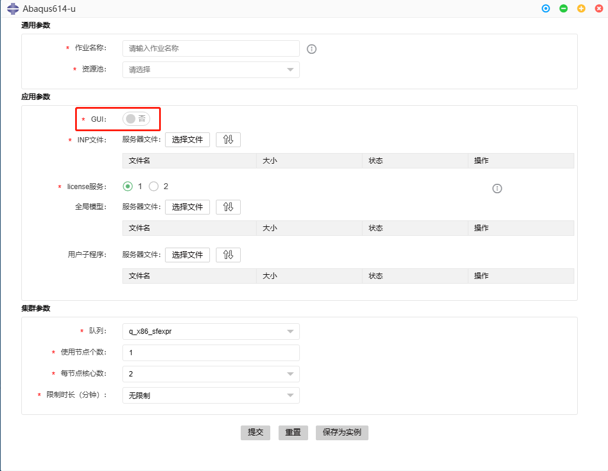
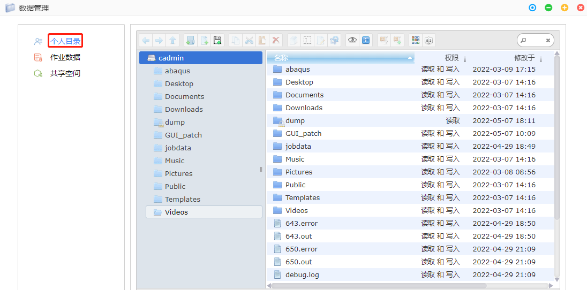

# 第3章 常用功能
## 界面总览
 
### 底部dock栏
dock栏集成了平台常用的几个功能，通过中间按钮控制dock栏的显示模式：
按钮为 时，dock为显示模式，一直浮现在页面最上层
按钮为 时，dock为自动隐藏模式，鼠标单击桌面其他区域，或者离开dock区域超过2s，则dock栏自动隐藏至页面底部，鼠标下滑过页面底部dock栏将浮现出来。

dock栏包含：
- {ref}`图形应用`
- {ref}`仿真计算`
- {ref}`远程桌面`

- {ref}`作业管理`
- {ref}`数据管理`
- {ref}`应用商城`

### 顶部topbar
顶部topbar含有以下几个功能按钮：
- 应用收纳
- 功能管理
  - {ref}`作业管理`
  - {ref}`在线协同`
  - {ref}`数据管理`
  - {ref}`队列资源`
  - {ref}`应用商城`
  - {ref}`远程桌面`
  - {ref}`命令终端`
- 组织管理
  - {ref}`用户管理`
  - {ref}`组织账单`
- 个人功能
  - {ref}`用户信息`
  - {ref}`密码管理`
  - {ref}`个性化配置`
  - {ref}`余额管理`
  - {ref}`用户账单`
  - {ref}`产品价格`
  - {ref}`私有应用`
  - {ref}`帮助文档`
  - {ref}`用户退出`
- 消息通知
  - {ref}`消息提醒设置`
### 桌面应用图标区
桌面应用图标区显示用户已订阅的的应用图标
### 外部链接区
显示神工坊相关外部链接
- 帮助文档
- 技术邻专栏
- 平台公众号
- 客服微信

##  图形应用

<!-- <div id="GUI_app"></div>

<span id="jump">跳转到的地方</span> -->

  

设计类、可视化类应用软件，需提交至GPU渲染队列以使用GPU加速渲染功能。

### 基本使用

双击应用图标，即可打开应用。


### 配置实例

右击应用图标


- **设置默认实例：** 选择双击打开的应用实例。
- **编辑实例：** 用户自定义实例。
- **软件点评：** 用户对软件进行评价。
- **隐藏应用：** 将软件图标隐藏，移入收纳区。

点击编辑实例进入实例编辑界面，一般存在一个系统默认实例，即**基本使用**中双击打开的实例。


点击**新增实例**，根据需要修改参数，例如：

- 实例名称：VDI
- 资源池：AIP资源池
- 图形界面：VDI方式
- 队列：GPU_sf
- 限制运行时长：30
- CPU核数：1


点击保存，即可查看新增的实例。左侧勾选后，点击**设置为默认实例**将新增的实例设置为默认。


### VNC与VDI
图形界面分为VDI方式和VNC方式。前者需付费开通{ref}`远程桌面`，后者无需额外步骤。

|  图形界面   | 额外操作  | 是否额外付费 |  性能 |
|  :----:  | :----:  |  :----:  |  :----:  | 
| VDI  | 开通远程桌面|是 | 高 |
| VNC  | 无需额外步骤 | 否 | 一般 |

## 仿真计算

 

仿真求解类软件，需提交至CPU计算队列。

### 基本使用

按钮介绍：
- **提交**：提交作业。
- **重置**：清空配置的参数。
- **保存为实例**：将该应用配置的参数保存，可设为默认参数打开，无需每次在界面配置参数。参见{ref}`配置实例`。


### 仿真计算的BATCH模式

若**GUI**开关为**否**，则为BATCH模式。适用于大规模计算。队列请选择CPU计算队列。



### 仿真计算的GUI模式

若**GUI**开关为**是**，则为GUI模式启动。适用于进行简单的前后处理并且在GUI界面提交作业。队列请选择GPU渲染队列。


**提示** 若需要使用更高性能的前后处理，请使用**图形应用**下相应的软件。

#### VNC与VDI
GUI模式下，图形界面分为VDI方式和VNC方式。前者需付费开通{ref}`远程桌面`，后者无需额外步骤。

|  图形界面   | 额外操作  | 是否额外付费 |  性能 |
|  :----:  | :----:  |  :----:  |  :----:  | 
| VDI  | 开通远程桌面|是 | 高 |
| VNC  | 无需额外步骤 | 否 | 一般 |


<!-- [图形应用](#fre.md图形应用)

[点击跳转](#jump)


[特色功能](./fre.md) -->
<!-- ## 远程桌面

 

远程桌面提供给用户一个具备图形界面的**Linux虚拟机**，图形应用通过GPU渲染后会显示在远程桌面中。用户还可以在远程桌面中通过命令行执行相关命令，如程序编译、运行、脚本执行等。远程桌面挂载了用户的存储空间，可直接通过命令行访问存储目录。

### 远程桌面开通

点击进入远程桌面，选择规格，点击开通。


### 远程桌面退订
点击其他功能按钮 > 远程桌面 > 退订


### 远程桌面使用
远程桌面为Linux虚拟机，使用方式与一般Linux桌面相同相同。

 -->
## 作业管理

 

在作业管理视图中，用户可根据不同的字段组合查找目标作业，用户还可根据作业状态进行停止、暂停、恢复、重新调度、优先级调整、延长作业时间、查看输出等操作。重新调度的作业会被停止并重新启动，但作业号保持不变。为了调整作业调度顺序，用户可对自己名下处于等待状态的作业进行作业优先级设置、置顶或置底操作。系统支持对多个作业进行批量操作，所以作业操作系统都会根据状态的变化发送作业通知。

### 什么是作业

用户在平台运行设计桌面及仿真计算应用都会生成相应的作业。为了方便用户对自己的作业进行生命周期管理，系统提供统一的作业管理视图。每个作业有唯一的**作业号**。

作业的状态包括：
- 运行：正在运行的作业。
- 等待：等待资源的作业。
- 等待时暂停：作业在等待时被暂停。
- 被系统暂停：作业被调度策略暂停。
- 被用户暂停：作业被管理员或用户暂停。
- 完成：作业正常结束。
- 退出：作业退出或以非0退出码结束。
- 未知：作业的运行主机失去联系，导致作业状态未知。
- 僵尸：作业进程异常，需要人工干预。
- 出错：作业因未知原因出错。

### 查看作业列表

点击作业管理在作业列表中查看系统中当前用户的所有作业的基本信息，包括作业号、作业名、所属用户、应用、队列、状态、提交时间、开始时间、结束时间、所属项目、所属资源池以及作业优先级。在列表中单击某个作业的作业号，将跳转至该作业的详情页面：


**基本信息**标签页：

- 作业基本信息：该作业的提交主机、运行主机、部件、作业目录、执行命令、等待原因等；
- 作业资源信息：该作业的线程数、CPU实际时间、内存使用量、交换分区使用量等；


**作业数据**标签页：

- 查看作业的输入文件、输出文件等。可在此区域对作业数据中的文件夹及文件进行操作。支持的操作包括（但不限于）：文件/文件夹的新建、复制、剪切、删除、创建副本、预览、查看详情、创建压缩包


### 查询作业

1. 点击作业管理，在作业列表右上方单击查询按钮 。
2. 在展开的查询条件区域中设置一个或多个查询条件，如作业号、作业名或作业的所属应用等，单击查询。作业列表中将展示查询结果。
3. 在作业列表上方单击重置按钮，将再次按照当前的查询条件进行查询，刷新作业列表。


### 停止作业

杀掉未运行完成的作业。

1. 点击作业管理，在作业列表中选择一个或多个要停止的作业，单击停止
2. 在弹出的确认对话框内单击确定。作业将退出。

**注意** 除“退出”及“完成”状态以外的作业均可执行此操作。

**警告** 此操作为高危操作，且不可逆转，请慎重。作业被成功停止后即变为“退出”状态。

### 暂停作业

1. 点击作业管理，在作业列表中选择一个或多个要暂停的作业，单击暂停。
2. 在弹出的确认对话框内单击确定。作业将暂停：

 <!--  -->

**注意** 除“退出”及“完成”状态以外的作业均可执行此操作。

- 如执行此操作时，作业处于“等待“状态，则此操作执行成功后，作业状态变为“等待时暂停”
- 如执行此操作时，作业处于其他状态，则此操作执行成功后，作业状态变为“被用户暂停”

**提示** 也可以在作业的详情页面上进行暂停操作：
  - 在作业列表中单击要暂停的作业的作业号，进入其详情页面。
  - 在页面顶部单击暂停。
  - 在弹出的确认对话框内单击确定。

### 恢复作业


1. 点击作业管理，在作业列表中选择一个或多个要恢复的作业，单击恢复。
2. 在弹出的确认对话框内单击确定。

**注意** 仅“等待时暂停”、“被用户暂停”及“被系统暂停”状态的作业可执行此操作。

### 重新调度作业


重新调度的作业会被停止并重新启动，但作业号保持不变。

1. 点击作业管理，在作业列表中选择一个或多个要重新调度的作业，单击重新调度。
2. 在弹出的确认对话框内单击确定。

**注意** 除“退出“及”完成“状态以外的作业均可执行此操作。

**警告** 此操作为高危操作，且不可逆转，请慎重。作业被重新调度时将先被停止，然后再被调度和启动，有可能出现调度等待等状况。

### 查看作业输出


1. 点击作业管理，在作业列表中选择一个“运行”状态的作业，单击查看输出。
2. 在弹出的页面上查看作业输出。


**提示** 也可以在作业的详情页面上进行查看输出操作：

- 在作业列表中单击要查看输出的作业的作业号，进入其详情页面。
- 在页面顶部单击查看输出。
- 在弹出的页面上查看作业输出。


### 作业置顶、置底


为了调整作业调度顺序，用户可对自己提交的且当前处于等待状态的作业进行置顶操作。

1. 点击作业管理，在作业列表中选择一个要置顶的作业，单击作业置顶。
2. 在弹出的确认对话框内单击确定。此操作执行成功后，当该作业可被系统调度执行时，将在其所在的作业队列中被**优先调度**。

**注意** 仅“等待”或“等待时暂停”状态的作业可执行此操作。

为了调整作业调度顺序，用户可对自己提交的且当前处于等待状态的作业进行作业置底操作。

1. 在作业列表中选择一个要置底的作业，单击作业置底。
2. 在弹出的确认对话框内单击确定。此操作执行成功后，当该作业可被系统调度执行时，将在其所在的作业队列中最后被调度。

**注意** 仅“等待”或“等待时暂停”状态的作业可执行此操作。

**提示** 也可以在作业的详情页面上进行作业置底操作：
- 在作业列表中单击要置底的作业的作业号，进入其详情页面。
- 在页面顶部单击作业置底。
- 在弹出的确认对话框内单击确定。


### 作业VNC图形窗口

1. 点击作业管理，在作业列表中单击一个要进入其图形窗口的作业的作业号，进入其详情。
2. 在该作业的详情页面右上角单击**图形窗口**。
3. 在打开的作业图形窗口中进行操作。


**提示** 也可以通过作业管理作业号右边小图标进入。

### 重新提交作业参数

1. 点击作业管理，在作业列表中单击要重新提交参数的作业的作业号，进入其详情页面。
2. 在该作业的详情页面右上角单击提交参数。
3. 在弹出的提交参数对话框上查看当前作业的参数配置，可根据需要修改参数或保持当前参数不变，单击提交。将重新生成一个作业。


### 设置优先级


为了调整作业调度顺序，用户可对自己提交的且当前处于等待状态的作业进行设置作业优先级的操作。

1. 点击作业管理，在作业列表中勾选需重新设置优先级的作业号。
2. 在作业管理页面右上角单击设置优先级。
3. 在弹出的设置优先级对话框上查看当前作业的当前优先级（默认为50），优先级输入范围为1~100,数字越大优先程度越高，可根据需要修改作业优先级或保持当前作业优先级不变，单击确认。此操作执行成功后，当该作业可被系统调度执行时，将在其所在的作业队列中按照作业优先级的大小进行调度。

### 历史作业

在作业管理模块中，系统还将显示当前系统的历史作业，历史作业是系统按照设置的过期时间自动将近期作业转换而成的。在历史作业中管理员可以进行数据追溯。

 

1. 点击作业管理，在作业管理页面左上方点击历史作业。
2. 页面显示已成为历史作业的作业数据。展示和近期作业一样。
## 数据管理

 

系统针对作业数据、用户个人目录和{ref}`共享空间`提供了完备的数据管理功能。

“神工坊”高性能仿真平台为增强作业数据的管理，以列表方式展示作业数据信息。在作业数据页面中，用户可根据不同的搜索条件查找属于自己名下作业条目。作业数据列表显示作业名、作业目录、归档状态、删除状态、数据大小等核心信息，通过链接方式可快速定位作业数据目录和作业详情。

### 什么是作业数据

在作业数据管理中，用户可删除或归档选定作业的数据内容，作业数据删除是清除作业目录下的输入输出文件，可有效节省空间。作业归档是对重要作业进行单独保存，防止误删或遗忘，可以帮助用户管理其重要作业数据，归档目录由管理员单独配置。作业归档操作可反复执行，每次归档都将覆盖既有文件。
用户的作业数据保存在用户的作业目录下，默认为:
```
/share/simforge_home/<组织名>/<用户名>
```
### 什么是个人目录

用户个人目录是以可视化的形式展示用户目录下的全部可用目录、数据文件及文件夹，用户可以选择特定文件分享到其权限下的共享组或项目空间。系统支持一个用户拥有多个数据目录，不同的数据目录可分属集群中不同的存储，此功能可快速帮助用户进行存储扩容。

### 查看个人目录

1. 在数据管理页面上的左侧导航树中单击个人目录。
2. 在右侧图形化界面上查看个人目录下的文件夹及文件信息。用户的个人目录通过管理员在管理门户进行对用户的目录设置：

 

### 个人目录下的文件操作

1. 在数据管理页面上的左侧导航树中单击个人目录。
2. 在右侧图形化界面上对个人目录下的文件夹及文件信息进行操作。支持的操作包括（但不限于）：

- 文件/文件夹的新建、复制、剪切、删除、创建副本、预览、查看详情、创建压缩包
- 图标视图/列表视图切换、转到上一级文件夹
- 文件共享 可将个人目录文件共享至项目或者共享空间


 

### 个人目录下删除文件

选择需要删除的文件，右键点击后，选择删除，提示文件会移至垃圾箱，点击删除按钮后，文件会移至个人目录下的Trash文件夹。在Trash文件夹中选中文件，右键点击后，选择删除，文件就会彻底删除。


 

### 查看作业数据列表

1. 在数据管理页面上的左侧导航树中单击作业数据。
2. 在作业数据列表中查看当前用户的所有作业数据的信息，包括各作业数据所对应的作业的作业号、作业名称、所属应用、所属队列、作业状态、提交时间、开始时间、结束时间、所属项目、资源池以及优先级。
3. 在列表中单击某条作业数据的作业号，将跳转至该作业的详情页面。
4. 在作业详情页面可点击作业数据，页面切换该作业的作业目录，将跳转至该作业数据的文件页面，可在此页面上进行常见的文件操作。

 

### 查询作业数据

1. 在数据管理页面上的左侧导航树中单击作业数据。
2. 在作业数据列表右上方单击查询按钮。
3. 在展开的查询条件区域中设置一个或多个查询条件，如作业号、作业数据目录、作业所属应用等，单击查询。作业数据列表中将展示查询结果。
4. 在作业列表上方单击重置按钮，将再次按照当前的查询条件进行查询，刷新作业列表。

<!-- ### 归档作业数据

作业数据归档是对重要作业进行单独保存，防止误删或遗忘，可以帮助用户管理其重要作业数据。归档目录由管理员单独配置。作业归档操作可反复执行，每次归档都将覆盖既有文件。 -->

### 删除作业数据

1. 在数据管理页面上的左侧导航树中单击作业数据。
2. 在作业数据列表中选择一个或多个作业数据，单击删除数据。
3. 在弹出的确认对话框内单击确认。

**注意** “运行”状态或“等待”状态的作业的作业数据无法删除。

**警告** 此操作为高危操作，且不可逆转，请慎重。如作业数据未归档且未通过其他形式备份，被删除后将无法找回。


<!-- ### 共享空间

请至[特色功能](./feature.md)中查看 -->
## 应用商城
 
### 应用订阅

 

1. 应用商城分上下两部分，上半部分为用户已订阅应用，下部分为商城全部应用
2. 用户根据应用简介选择合适应用，点击“申请订阅”按钮，完成应用订阅申请
3. 后台管理员收到订阅申请，审核通过后会显示在已订阅应用

 

### 应用退订

1. 应用商城分上下两部分，上半部分为用户已订阅应用，下部分为商城全部应用
2. 用户选择需要退订的应用，单击 退订按钮，应用退订成功
3. 应用退订后，再次申请订阅需要重新审核，请谨慎退订

 
### 应用评价

1. 右击桌面已订阅应用，选择软件点评。
2. 软件评分界面分为上下两部分，上半部分为应用的评价情况，下半部分为用户点评区域。
3. 输入点评内容，选项评分等级，点击提交。

 

 

### 应用文档下载

在应用商城上半部分“已订阅应用”部分点击右侧“查看”，即可查看管理员发布的应用文档（不局限于应用使用文档，还可能包括仿真应用测试文件等）。

 


## 队列资源

- 点击**其他功能**，在下拉列表中选择**队列资源**。
- 队列名：队列名称。一般为CPU计算队列x86_sf和图形渲染队列GPU_sf。
- 最大可用作业槽数：一般可以认为是该队列最大处理器核数。默认情况下，一个作业槽就是一个处理器核。
- 运行的作业槽数：占用的处理器核数。
- 可用的作业槽数：可供提交的处理器核数。


