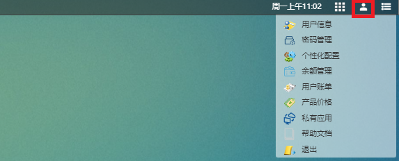

# 第5章 个人功能

## 用户信息

可查看用户基本信息，包括：

- 用户账号：用户门户登陆账号
- 用户姓名：用户昵称
- 用户邮箱：注册时使用的邮箱，用于接收信息，如作业提醒
- 联系电话：用于接收信息，如作业提醒
- 用户组织：用户所属组织
- 所属用户组：组织成员可以组成用户组
- 用户部门：用户所在组织的部门
- 用户角色：用户角色代表其权限
- 用户可使用的应用：用户当前可订阅的应用
## 个性化配置

### 密码设置
- 初始密码为随机生成。为了安全起见，请定期更改密码。如忘记密码，请联系管理员。

### 用户信息设置
- 可修改邮箱和联系电话。

### 用户余额充值
- **授权额度**：用户可以透支的金额。
- **在线充值**：使用支付宝进行充值，完成后实时到账。
- **本地充值**：用户输入充值金额以及合同编号，点击确认后，需管理员后台审核通过后到账。

### 桌面背景设置
- 用户可根据喜好改变桌面背景

### 个人清理设置

- 作业文件保留天数：指调度器输出的以作业号命名的*.out以及*.error文件。不是用户上传的文件和求解器输出的文件。

### 消息提醒设置

- 作业状态提醒
- 个人存储容量提醒

建议开启。

## 用户账单

## 产品价格

